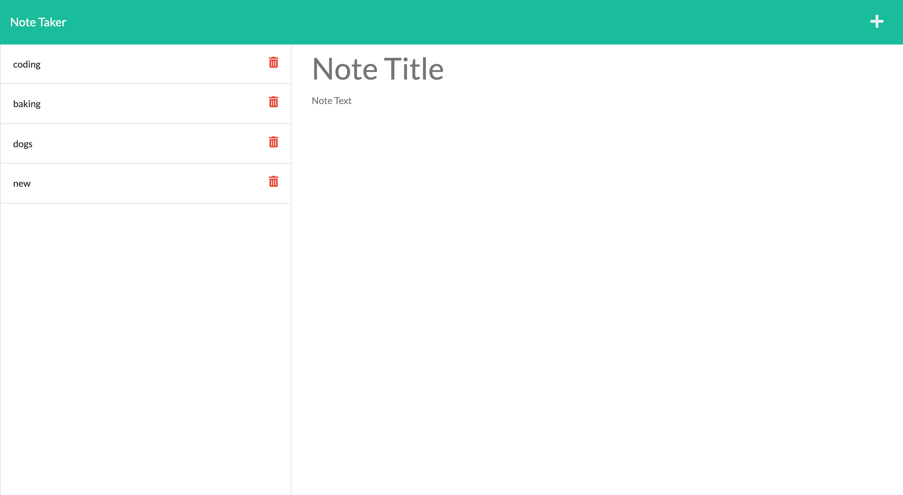

# Note-Taker
## **Table of Contents**
* [Description](#Description)
* [Contributing](#Contributing)
* [Questions](#Questions)
* [Website](#Website)
* [License](#License)

## **Description**
A note taker application using express that allows users to add and delete notes.

## **Contributing**
To contribute please email me and see guidelines.
[Contributor Covenant](https://img.shields.io/badge/Contributor%20Covenant-2.1-4baaaa.svg)]

## **Questions**
Please contact me at katieshake27@gmail.com with any questions.

Vist my gitHub page at https://github.com/kgendaszek!

## **Website**
https://note-taker-kg.herokuapp.com/

https://github.com/kgendaszek/note-taker

## **License**
### 

[MIT license](https://opensource.org/licenses/MIT)

[License](LICENSE)
